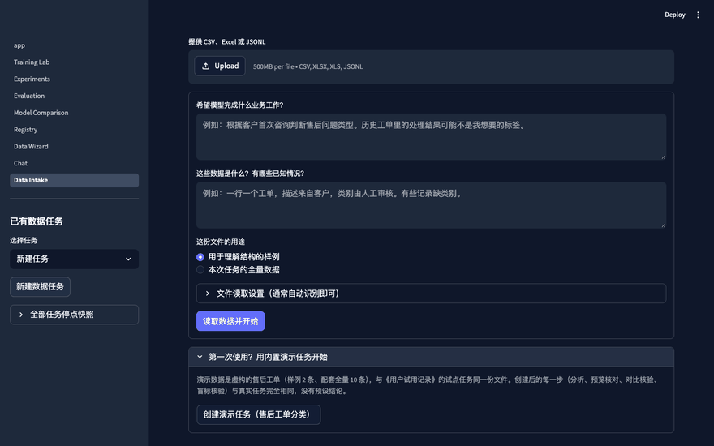

<div align="center">

# TuneSmith 🔨

**A fine-tuning workbench for small businesses and individuals who cannot hire an algorithm engineer. Start with a business goal and sample data; an Agent helps clarify the task, diagnose data gaps and preview a processing recipe. A built-in semantic safety layer — blind label verification, contrast checks and a learnability probe — keeps the business judgments only you can make from silently passing. Existing local training, evaluation and model management support the next steps.**

The goal-and-data workflow is under active development. Sample analysis, real conversion previews, full-data validation, training and iteration are connected and have been exercised with fictional data on local hardware. Real customer acceptance and demonstrated business benefit remain open. [North star & product goals](docs/plans/north-star.md) · [Configure your Agent provider (BYOK)](docs/agent-setup.md)

* formerly "4-bit QLoRA Post-Training Framework"

[](https://benluo.art/qlora-dashboard/)
[](https://github.com/Bensonluo/4bit-QLoRA-post-training/stargazers)
[](LICENSE)

[](https://www.python.org/)
[](https://pytorch.org/)
[](https://huggingface.co/)
[](https://github.com/QwenLM/Qwen)
[](https://streamlit.io/)

<!-- 🎬 录制说明:用 kap/licecap 录 30 秒 dashboard 操作流程,存到 docs/assets/dashboard.gif -->


*🎬 Replace this with a 30s GIF of the dashboard — see [Recording Guide](#-demo-recording-guide) below*

</div>

---

## 📌 Table of Contents

- [Why This Project](#-why-this-project)
- [Key Highlights](#-key-highlights)
- [Goal & Data Workflow (Agent-Assisted)](#-goal--data-workflow-agent-assisted)
- [Supported Models & Hardware](#-supported-models--hardware)
- [Quick Start](#-quick-start)
- [Data Wizard (Guided Data Preparation)](#-data-wizard-guided-data-preparation)
- [Distributed Training (FSDP / DeepSpeed)](#-distributed-training-fsdp--deepspeed)
- [Model Registry (Lifecycle & Lineage)](#-model-registry-lifecycle--lineage)
- [Dashboard Tour](#-dashboard-tour)
- [Domain Adaptation](#-domain-adaptation)
- [Project Structure](#-project-structure)
- [中文说明](#-中文说明)

---

## 💡 Why This Project

The product's north star is to help small businesses and individuals complete fine-tuning that meets their own domain needs at an affordable cost, with less dependence on algorithm specialists. The first development priority is the work before training: understanding the goal together with the supplied data, finding missing supervision, resolving business ambiguity and executing the right data preparation. Templates are examples, not the limit of supported business needs. MLflow and result charts support validation later in this process.

Most QLoRA tutorials assume an A100 and stop at `trainer.train()`. Reality for most practitioners:

- ❌ You have an **RTX 4060 (8GB)** or a **MacBook Pro M2**, not a datacenter GPU
- ❌ You need to actually **compare models**, not just train one and guess if it's better
- ❌ Apple Silicon users are stuck — most QLoRA guides are CUDA-only
- ❌ "Fine-tuning" feels like a black box with no UI to visualize what's happening

This project solves all of them:

> 🔥 **Train Qwen3-4B in 8GB VRAM** with 4-bit QLoRA — or train **Qwen3-14B on Apple Silicon** in bf16 — with a Streamlit dashboard for the entire lifecycle and MLflow for experiment tracking.

The existing implementation provides the training and evaluation foundation: SFT, DPO, GRPO, domain adaptation, evaluation, and side-by-side model comparison.

---

## ✨ Key Highlights

<div align="center">

| 🚀 Training | 📊 Tracking | 🎯 Evaluation |
|:---:|:---:|:---:|
| SFT + DPO + GRPO + Domain | MLflow + **Model Registry** ⭐ | Difficulty-stratified |
| Cross-platform auto-detect | Live loss curves | Multi-model comparison |
| **FSDP + DeepSpeed** ⭐ | Run diff viewer + lineage | Confidence calibration |

| 🍎 Apple Silicon | 🖥️ NVIDIA | 📋 Reporting |
|:---:|:---:|:---:|
| bf16 via MPS | 4-bit QLoRA | Markdown exec summary |
| Up to 14B on 64GB | 84% VRAM savings | Cost estimation |
| Zero-config detect | Multi-GPU scale-out | Deploy recommendations |

| 🤝 Agent Intake | 🛡️ Semantic Safety | 🧪 Long-Tail | 🔁 Iteration |
|:---:|:---:|:---:|:---:|
| BYOK analysis agent | Blind label verification | Sandboxed adapter code | Frozen eval suites |
| Goal + data joint diagnosis | Contrast checks (no blind nodding) | Real OS isolation | Base / parent / round compare |
| Real before/after previews | Learnability probe + scenario matrix | Business cases + counterexamples | Adopt / iterate / stop |

| 📈 Stats | | |
|:---:|:---:|:---:|
| **84%** VRAM savings (NVIDIA) | **0.6B–14B** model range | **4** post-training techniques |
| **8** dashboard pages | **5+** model families | **FSDP + DeepSpeed + DDP** distributed |

</div>

### 🧠 What makes it different

1. **Agent-assisted intake** — start from a business goal and a raw spreadsheet, not a prepared dataset; a BYOK analysis agent (GLM / local / any OpenAI-compatible service) turns "I have data" into a validated training recipe, and long-tail rules fall back to sandboxed adapter code instead of a dead end
2. **True cross-platform** — one codebase, auto-detects CUDA / MPS / CPU, no config flags
3. **Full lifecycle dashboard** — not just training, but experiment management + evaluation + comparison
4. **Domain adaptation system** — pluggable domains with a built-in medical entity showcase (Chinese drug/hospital name normalization)
5. **Honest evaluation** — difficulty-stratified metrics (easy/medium/hard) instead of one aggregate number; in business comparisons, failures and truncations stay in the denominator
6. **Executive summaries** — auto-generated Markdown reports with cost estimation and deployment recommendations

---

## 🎯 Goal & Data Workflow (Agent-Assisted)

The primary entry point. Describe a business goal in plain language, upload sample data (CSV / Excel / JSONL), and a BYOK analysis agent — GLM Coding Plan, GLM API, a local service, or any OpenAI-compatible endpoint — does the professional work between "I have some data" and "this is a valid training set":

```text
goal + samples ─▶ joint diagnosis & clarifying questions ─▶ data recipe + real before/after previews
  ─▶ user proves meaning (contrast pairing + blind labeling) ─▶ full-data validation ─▶ grouped train/val/test partitions (content-hash versioned)
  ─▶ tokenizer preflight (real truncation & answer-loss stats) ─▶ agent-recommended training plan
  ─▶ local training (one authorized OOM recovery) ─▶ baseline vs fine-tuned on the same frozen dev set
  ─▶ bad-case evidence ─▶ next-round hypothesis ─▶ second round under a frozen eval suite
  ─▶ base / parent / round 3-model comparison ─▶ adopt / iterate / stop ─▶ final acceptance on held-out test
```

The whole loop lives on one page (**目标与数据**, `ui/pages/07_Data_Intake.py`) or the equivalent CLI (`python scripts/data_intake.py create / analyze / materialize / plan-recommend / train-start / eval-compare / iteration-* / acceptance-*`).

**Design properties:**

| Property | What it means |
|---|---|
| Semantic safety layer (task-agnostic) | 盲标核验 hides existing answers and asks you to label samples yourself; 对比核验 makes you pair answers to the right inputs instead of nodding through a preview; a learnability probe estimates whether the data can learn the task before GPU-hours are spent — these checks block training when they fail, because misjudged business meaning silently poisons everything downstream |
| Scenario matrix regression | A growing matrix of 41 input scenarios (GBK encodings, wide tables, mixed types, punctuation variants, …) runs as honest regression — each scenario records expected-vs-actual so coverage claims stay checkable |
| Business confirmation, not code review | Users validate meaning through real transformation previews (raw row → model input → answer); agent-drafted long-tail adapter code is verified against business cases **and counterexamples** before use, never executed unreviewed on real data |
| Real isolation for long-tail code | Adapter / custom-scoring code runs only inside Docker (`--network=none`, read-only, `--cap-drop=ALL`, non-root, pids/memory limits) or macOS Seatbelt (deny-by-default profile); no host fallback — an unavailable backend returns `unavailable`, not a silent bypass |
| Content-hash identity | Base weights, data versions, and eval protocols are identified by SHA-256 of actual content; a changed file invalidates stale confirmations and cached comparisons instead of reusing them |
| Frozen evaluation suites | Dev and final-test questions are frozen per round; new data can extend training but never rewrites the scored denominator, so round-over-round deltas stay comparable |
| One authorized OOM recovery | A single technical retry (smaller micro-batch + more grad accumulation, or gradient checkpointing) is tied to the same business round and recorded as such — no silent re-runs passed off as evidence |
| Honest evidence | Generation failures and truncations stay in the denominator; open-ended tasks stay "pending business review" instead of getting a fake accuracy; a round can conclude `insufficient_evidence` |

**Status (2026-09):** the full loop — including a second improvement round, three-model comparison, and a separate final-acceptance workflow — is implemented and verified end-to-end on local hardware with fictional data (real Qwen3 training on Apple Silicon, real GLM analysis; evidence in [`docs/validation/`](docs/validation/)). Real customer tasks and demonstrated business benefit are the open milestone.

📖 [North star & product goals](docs/plans/north-star.md) · [Agent setup (BYOK)](docs/agent-setup.md) · [Long-tail adapters & sandbox](docs/agent-adapters.md) · [Business evaluation & bad-case evidence](docs/business-evaluation.md)

---

## 🖥️ Supported Models & Hardware

### Model Compatibility

| Model | NVIDIA VRAM (4-bit) | Apple Silicon 64GB (bf16) |
|-------|---------------------|---------------------------|
| Qwen3 0.6B | ~1.2 GB | ~1 GB |
| Qwen3 1.7B | ~2.0 GB | ~2 GB |
| Qwen3 4B | ~3.5 GB | ~4 GB |
| Qwen3 8B | ~6.0 GB | ~8 GB |
| Qwen3 14B | ⚠️ Needs 16GB+ | ~14 GB |
| Llama 3.2 1B | ~1.8 GB | ~2 GB |
| Llama 3.2 3B | ~4.5 GB | ~6 GB |
| Qwen 0.5B / 1.5B | ~1.5 / ~2.3 GB | ~1 / ~3 GB |

### Hardware Requirements (any one)

- 🖥️ **NVIDIA GPU** — 8GB+ VRAM (RTX 4060 / 3060 / 4070 sufficient for ≤4B models)
- 🍎 **Apple Silicon** — 16GB+ unified memory (M1/M2/M3/M4 Pro/Max/Ultra)
- 💻 **CPU** — for testing/validation only (not recommended for real training)

---

## 🚀 Quick Start

### Option 1: Dashboard (recommended)

```bash
git clone https://github.com/Bensonluo/4bit-QLoRA-post-training.git
cd 4bit-QLoRA-post-training

python -m venv venv && source venv/bin/activate
pip install -e ".[ui]"        # Installs MLflow + Streamlit + Plotly

# Launch MLflow + Streamlit dashboard
python scripts/launch_dashboard.py
```

Open http://localhost:8501 and choose **目标与数据**. Configure the analysis Agent,
describe the business goal, and upload sample data. Review the Agent's questions
and actual transformed examples, then provide full data and confirm the training
partitions. The same page supports local model training, baseline/adapter
comparison, and evidence-based next-step advice. See [Agent setup and workflow](docs/agent-setup.md).

This workflow is under active development. Local execution has been verified on
fictional data, including a second improvement round and a separate final
acceptance workflow. Real customer acceptance and demonstrated business benefit
remain open. Existing Training Lab presets are also available for prepared datasets.

### Option 2: Try the Live Dashboard

Don't want to install? **[Try the dashboard online →](https://benluo.art/qlora-dashboard/)**

### Option 3: CLI training

```bash
# Quick validation run (5–10 min)
python scripts/train_quick_test.py

# Medical entity domain training
python scripts/train_medical_entity.py --poc    # 8GB NVIDIA GPU
python scripts/train_medical_entity.py --mac    # Apple Silicon
python scripts/train_medical_entity.py          # 24GB GPU (full)

# Custom dataset SFT
python scripts/train_sft.py --train-file data/custom/my_data.jsonl

# DPO preference optimization
python scripts/train_dpo.py --quick-test
```

> 💡 **In China?** Set HF mirror to avoid download timeouts:
> ```bash
> export HF_ENDPOINT=https://hf-mirror.com
> ```

### CLI Commands

After an editable install (`pip install -e ".[dev]"`), all ten console commands below are available on your PATH:

| Command | Description |
|---------|-------------|
| `train-sft` | Supervised Fine-Tuning (SFT) with QLoRA |
| `train-domain` | Domain-adaptation training (built-in: medical entity matching) |
| `train-dpo` | DPO preference training on chosen/rejected pairs |
| `train-grpo` | GRPO training with pluggable reward functions |
| `merge-lora` | Merge a trained LoRA adapter into the base model |
| `evaluate-model` | Evaluate fine-tuned models (perplexity, generation, comparison) |
| `eval-harness` | Benchmark on public tasks via lm-evaluation-harness (`.[eval]` extra) |
| `run-flywheel` | Run one iteration of the self-improving data flywheel |
| `download-data` | Download and prepare datasets from Hugging Face or local sources |
| `qlora-dashboard` | Launch the MLflow + Streamlit dashboard |

---

## 🧙 Data Wizard (Guided Data Preparation)

Most fine-tuning projects die at step zero: turning a raw spreadsheet into a training set. The Data Wizard walks a non-ML engineer through it — import a CSV/Excel/JSONL of `alias → standard name` rows, and it handles candidate sampling, difficulty stratification, dedup, splitting, and quality checks:

```bash
# Step 1: see what the wizard would do (no files written)
python scripts/data_wizard.py --input data/raw/drugs.csv --suggest

# Step 2: generate train/val/test + quality report
python scripts/data_wizard.py --input data/raw/drugs.xlsx --out-dir outputs/wizard/drugs

# Override the auto-detected column mapping if needed
python scripts/data_wizard.py --input drugs.csv \
    --standard-col 标准名 --query-col 别名 --code-col 编码

# Typo-robustness copies (corrupted query + unchanged answer, one per sample)
python scripts/data_wizard.py --input drugs.csv --noise-augment
```

**Built-in guardrails** (the expert judgment is baked in, not required from you):

| Stage | What it does | Why it matters |
|-------|--------------|----------------|
| Column mapping | Auto-suggests which column is the alias / standard name / code | H2O LLM Studio-style import UX |
| Candidate sampling | Builds multiple-choice lists with prefix hard-negatives, **randomly shuffled** | Prevents position-bias shortcut learning |
| Entity-group split | All variants of one entity stay in the same split | Kills train/test leakage — the #1 silent metric killer |
| 数据体检 (health checks) | 7 gates: leakage, ambiguous aliases (one query → multiple standards), duplicates, position bias, candidate counts, dropped rows, difficulty balance | Errors block export; warnings explain the risk + fix in plain language |
| Difficulty stratification | easy / medium / hard by edit distance | Enables stratified evaluation later |
| Noise augmentation (opt-in) | `--noise-augment` appends a typo-corrupted copy of every query (adjacent swap / dropped / doubled char); labels & candidates unchanged, difficulty re-scored | Real users typo — the model learns "typos don't change the match"; val/test get perturbed views free |

Output: `train.json` / `val.json` / `test.json` in Alpaca format (drop-in compatible with `train-domain` and `MedicalEntityDataset`) plus a `wizard_report.json` with every check result. Exit code 0 = safe to train, 2 = fix first.

New verticals plug in via `register_template()` — the medical entity template is the reference implementation.

---

## 🌐 Distributed Training (FSDP / DeepSpeed)

Scale from a single GPU to multi-GPU with **zero training-loop changes**, using the **industry-standard 2026 stack**: FSDP (PyTorch-native) in bf16 full precision, with DeepSpeed for scale-beyond.

### One-liner launches

```bash
# FSDP — the PyTorch-native DEFAULT for multi-GPU LLM training (what Meta uses for Llama)
./scripts/launch/train_fsdp.sh 4 Qwen/Qwen3-1.7B

# DDP — plain replication, the simple baseline
./scripts/launch/train_ddp.sh 4 Qwen/Qwen3-1.7B

# DeepSpeed ZeRO-3 + offload — extreme scale (70B+, CPU/NVMe offload)
torchrun --nproc_per_node=8 scripts/train_sft_distributed.py \
    --model-name Qwen/Qwen3-72B --distributed-preset zero_stage_3_offload --quantization-bits 0
```

### Strategy at a glance

| Strategy | Shards | When to use |
|----------|--------|-------------|
| **FSDP full_shard** ⭐ | params + grads + optimizer | **DEFAULT** — standard multi-GPU, PyTorch-native |
| FSDP sharded_grad_scaled | grads + optimizer only | Lighter sharding (≈ ZeRO-2) |
| DDP | Nothing (full copy/GPU) | Simple baseline; model fits on one GPU |
| DeepSpeed ZeRO-2 | optimizer + gradients | Same idea as FSDP, via DeepSpeed |
| DeepSpeed ZeRO-3 + offload | everything (+ CPU/NVMe) | Extreme scale beyond FSDP |

> **2026 practice**: run FSDP in **bf16 full precision** (`--quantization-bits 0`). Full-parameter sharding (FSDP full_shard / ZeRO-3) is the standard; QLoRA is reserved for genuinely memory-tight single-GPU scenarios. The launcher warns if you combine full sharding with 4-bit quantization.

### Benchmark it

```bash
./scripts/launch/benchmark_distributed.sh Qwen/Qwen3-1.7B 4
```

Runs single-GPU → DDP → FSDP → ZeRO-2 → ZeRO-3 and logs throughput + memory. Paste (sanitized) results into [`benchmark/README.md`](benchmark/README.md).

📖 **Full guide**: [`docs/distributed_training_guide.md`](docs/distributed_training_guide.md) — FSDP vs DeepSpeed, strategy selection, QLoRA caveats, multi-node setup, troubleshooting.

---

## 🗂️ Model Registry (Lifecycle & Lineage)

Close the loop after fine-tuning: **merge → register → stage → trace**. Every registered model version links back to the exact training run that produced it (params + metrics), so you always know which model is in Production and why.

### Automatic registration

Flip two config flags and the trainer does the rest:

```python
LoggingConfig(
    use_mlflow=True,                # tracking must be on
    register_model=True,            # 🆕 auto-register after training
    registry_model_name="Qwen3-1.7B-QLoRA",
    merge_before_register=True,     # merge LoRA into base before logging
    registry_stage="Staging",
)
```

After `save_model()`, the trainer automatically: (1) merges the adapter into the base, (2) logs the merged model to MLflow, (3) registers it as a new version, (4) stages it. Registration failures never fail the training run.

No YAML editing needed — the dashboard's **Training Lab → Registry** section sets the same flags with two clicks (SFT & DPO; the UI hides it for GRPO, whose trainer has no registration hook).

### Manual registration (no retraining)

```bash
# Merge a previously-trained adapter
python scripts/merge_adapter.py \
    --adapter-dir outputs/sft/run-xxx \
    --output-dir outputs/merged/run-xxx

# Register it
python scripts/registry_cli.py register \
    --model-dir outputs/merged/run-xxx \
    --name Qwen3-1.7B-QLoRA
```

### Manage the lifecycle

```bash
# List all versions + stages
python scripts/registry_cli.py list

# Promote to Production
python scripts/registry_cli.py transition \
    --model-name Qwen3-1.7B-QLoRA --version 3 --stage Production

# Trace a version back to its training (params + metrics)
python scripts/registry_cli.py info \
    --model-name Qwen3-1.7B-QLoRA --version 3
```

📖 **Full guide**: [`docs/model_registry_guide.md`](docs/model_registry_guide.md) — lifecycle, lineage, troubleshooting. Includes 3 tracking bug fixes (DPO callback mount, double-write removal, lineage link).

---

## 📊 Dashboard Tour

Eight pages covering the full ML lifecycle — business goal through chatting with the result:

| Page | What you do there |
|------|-------------------|
| 🎯 **目标与数据 (Goal & Data)** | Start here — the agent-assisted workflow above: describe the goal, upload samples, review the Agent's diagnosis and real transformation previews, confirm full data and partitions, launch training, compare baseline vs fine-tuned, read bad-case evidence, drive the next round and final acceptance; every step also available via `scripts/data_intake.py` |
| 🧪 **Training Lab** | Pick preset (⚡ Quick / 🔥 Standard / 🚀 Full) → configure hyperparams → launch → watch live loss curves; dataset pre-filled automatically when sent from Data Wizard; submit-time **dataset preflight** blocks nonexistent paths / wrong formats (with a fix suggestion) before a single GPU-minute is wasted; a 🔍 **preview station** inspects any local dataset on demand (format + record count + first 3 samples) — no submit needed; finished runs show a 🧭 **next-steps panel** with a **one-click merge** button (adapter → standalone model in `outputs/merged/`, idempotent — already-merged runs show a ✅ and link straight to Chat) plus evaluate/register commands instead of a dead-end ✅ |
| 📈 **Experiments** | Browse all MLflow runs, filter by status/model, compare params, view metric diffs |
| 🎯 **Evaluation** | Domain-specific charts: accuracy by difficulty, entity type breakdown, calibration curves |
| ⚖️ **Model Comparison** | Side-by-side metric deltas, auto-generated executive summary, cost estimation |
| 🗃️ **Model Registry** | Registered versions with lineage, champion/challenger aliases, legacy stage transitions |
| 🧙 **Data Wizard** | Upload CSV/Excel/JSONL → confirm column mapping → one-click training-set generation with 7 quality checks (see above) → **send to Training Lab without touching a terminal** |
| 💬 **Chat** | Talk to any training artifact — pick an adapter from `outputs/` (base model auto-read from `adapter_config.json`) or a merged model / any base, load it in-process (adapter merged on the fly), and chat with **token-by-token streaming** (first token in ~1s, not after the whole generation); system prompt, temperature, thinking-mode controls included |

```bash
pip install -e ".[ui]"
streamlit run ui/app.py
```

---

## 🏥 Domain Adaptation

Domains are self-contained modules under `domains/`:

```
domains/medical_entity/
├── prepare_data.py    # Dataset preparation
├── evaluate.py        # Domain-specific evaluation
├── data/              # Train/val/test splits
└── eval/              # Custom eval logic + reports
```

### Built-in: Chinese Medical Entity Matching

Fine-tune Qwen3 to normalize drug names and hospital names — with **difficulty-stratified evaluation** (easy/medium/hard) and entity-type breakdown (drug, hospital, etc.).

### Adding your own domain

1. Add a dataset class in `src/data/`
2. Add config in `config/domains/`
3. Create `domains/your_domain/` with `prepare_data.py`, `evaluate.py`, `data/`
4. Register a chart adapter in `ui/components/domain_adapters.py`

---

## 📁 Project Structure

```
4bit-QLoRA-post-training/
├── config/                 # Configs + presets + model registry
│   ├── base.py             # Model / training / LoRA / logging configs
│   ├── sft.py  dpo.py      # Technique-specific presets
│   ├── models.yaml         # VRAM table + LoRA target modules
│   └── domains/            # Domain training presets
├── src/
│   ├── agent/              # BYOK analysis agent (providers, intake/training/eval/revision flows)
│   ├── workbench/          # Goal→data→training→evaluation→iteration services (business evaluation, sandbox, acceptance, …)
│   ├── models/             # Loading, quantization, merging
│   ├── data/               # Alpaca / Finance / Medical / DPO loaders + data wizard
│   ├── data_flywheel/      # Bad-case mining / synthesis pipeline + dataset registry
│   ├── training/           # SFT + Domain + DPO + GRPO trainers + callbacks
│   ├── evaluation/         # Metrics, generation, comparison
│   ├── inference/          # Chat model discovery + streaming engine
│   ├── tracking/           # MLflow integration + runner + registry
│   └── utils/              # Platform detection, logging, memory
├── ui/                     # Streamlit dashboard
│   ├── app.py              # Entry point
│   ├── components/         # Reusable charts, filters, adapters
│   └── pages/              # 8 dashboard pages
├── domains/                # Self-contained domain modules
├── scripts/                # CLI entry points (train/eval/merge)
├── notebooks/              # Educational Jupyter notebooks
├── docs/                   # Theory + tutorials
└── tests/                  # Unit + integration tests
```

---

## 🛠️ Configuration Examples

### Training Presets

```python
# config/sft.py
QUICK_TEST = TrainingConfig(
    model_name="Qwen/Qwen3-0.6B",
    lora_r=16, lora_alpha=32,
    max_samples=100, num_epochs=1,
)

STANDARD = TrainingConfig(
    model_name="Qwen/Qwen3-4B",
    lora_r=32, lora_alpha=64,
    max_samples=5000, num_epochs=3,
)
```

### Environment Variables

| Variable | Description | Default |
|----------|-------------|---------|
| `HF_ENDPOINT` | Hugging Face mirror (China) | `https://huggingface.co` |
| `CUDA_VISIBLE_DEVICES` | GPU selection | `0` |
| `MLFLOW_TRACKING_URI` | MLflow server | `file:./outputs/mlruns` |

---

## 🐛 Troubleshooting

<details>
<summary><b>Common issues</b></summary>

**Out of memory on 8GB VRAM**
```bash
python scripts/train_medical_entity.py --poc  # Uses Qwen3-4B with reduced seq length
```

**Model downloads stuck (China)**
```bash
export HF_ENDPOINT=https://hf-mirror.com
```

**Apple Silicon slower than expected**
- Check Activity Monitor → GPU History
- Ensure MPS is available: `python -c "import torch; print(torch.backends.mps.is_available())"`
- Use bf16 (default); fp32 will be ~3× slower

**MLflow UI not loading**
```bash
pip install mlflow
python scripts/launch_dashboard.py  # Starts both MLflow + Streamlit
```

</details>

---

## 🗺️ Roadmap

**Core line — from business goal to verified fine-tuning** ([north star](docs/plans/north-star.md)):

- [x] P0 · Goal + sample analysis: joint diagnosis, clarifying questions, data recipe with real previews
- [x] P1 · Data pipeline: multi-source composition, sandboxed long-tail adapters, full-data validation, grouped partitions, tokenizer preflight
- [x] P2 · First training round: agent-recommended plans, local training, baseline/adapter comparison on the same dev set, one authorized OOM recovery
- [x] P3 · Second round & acceptance: bad-case evidence, frozen eval suites, hypothesis-driven data revision, base/parent/round comparison, adopt-iterate-stop decisions, final acceptance on held-out test
- [ ] P0–P3 on real customer tasks (all stages above are technically verified end-to-end on fictional data; real business acceptance is the open milestone)
- [ ] P4 · On demand: DPO/GRPO through the same goal→data loop, external API models in comparisons, time-based splits for forecasting tasks

**Platform foundation (shipped):**

- [x] Cross-platform training (NVIDIA / Apple Silicon / CPU)
- [x] Semantic safety layer: blind label verification, contrast checks, learnability probe, scenario matrix regression
- [x] SFT + DPO + GRPO + Domain Adaptation
- [x] Streamlit dashboard (8 pages) + MLflow tracking + Model Registry
- [x] Distributed training (FSDP / DeepSpeed / DDP)
- [x] Medical entity + master data domain showcases
- [x] Difficulty-stratified evaluation

---

## 🤝 Contributing

Portfolio project, but PRs welcome — especially:
- 🎯 New domain adapters (legal, finance, code, etc.)
- 🍎 Apple Silicon performance optimizations
- 📊 New evaluation metrics or visualizations
- 🐛 Bug fixes with a failing test

---

## 📜 License

[MIT](LICENSE) — free for personal and commercial use.

If this project helped you fine-tune on budget hardware, please ⭐ star the repo.

---

## 📬 Contact

- 💼 **Portfolio**: [benluo.art](https://benluo.art)
- 🐙 **GitHub**: [@Bensonluo](https://github.com/Bensonluo)
- 💬 **Issues**: [GitHub Issues](https://github.com/Bensonluo/4bit-QLoRA-post-training/issues)

---

## 🇨🇳 中文说明

**面向小公司和个人使用者的微调工作台** — 从业务目标和样例数据出发:分析 Agent(自带模型服务,支持智谱 GLM / 本地模型 / OpenAI 兼容端点)联合分析目标与数据、产出可执行的数据处理方案与真实转换预览;再经对比核验与盲标核验确认监督语义、全量数据校验、独立分区物化、训练前 token 预检、训练方案推荐、本地训练、基座/微调同开发集对照、坏例诊断,进入固定题集下的第二轮改进与最终业务验收。训练底座在消费级硬件上微调 0.6B–14B 大模型(前身为 4-bit QLoRA 后训练框架)。

> 当前状态:完整闭环已在本地用虚构数据端到端验证(真实 Qwen3 训练 + 真实 GLM 分析,证据见 `docs/validation/`);真实客户任务与业务验收尚未完成。

### 核心亮点

- **目标与数据主线**:目标 + 样例 → Agent 联合分析 → 预览确认 → 全量校验 → 分区 → 训练 → 对照 → 下一轮
- **语义安全层(与任务类型无关)**:盲标核验(隐藏答案让用户自己标)、对比核验(配对选择,防盲点头)、可学性探针(训练前探明可学性)、确定性门禁——业务语义判断不静默通过;场景矩阵持续回归输入形态边界(编码、宽表、混合类型、标点变体等)
- **跨平台训练**:自动检测 NVIDIA GPU(4-bit QLoRA)/ Apple Silicon(bf16 MPS)/ CPU
- **四种后训练技术**:SFT(监督微调)、DPO(直接偏好优化)、GRPO(组相对策略优化,可插拔奖励)、领域适配
- **Streamlit 全生命周期面板**:目标与数据 → 配置训练 → 监控 → 评估 → 对比 → 对话,8 个页面
- **MLflow 实验追踪**:自动记录指标、参数对比、运行历史
- **领域适配系统**:内置医疗实体匹配示范(中文药品名/医院名归一化)
- **难度分层评测**:简单/中等/困难三档,带置信度校准
- **执行摘要自动生成**:Markdown 报告 + 成本估算 + 部署建议
- **Qwen3 全系列支持**:0.6B / 1.7B / 4B / 8B / 14B,LoRA r=16–64

### 快速开始

```bash
git clone https://github.com/Bensonluo/4bit-QLoRA-post-training.git
cd 4bit-QLoRA-post-training
pip install -e ".[ui]"
python scripts/launch_dashboard.py
# 打开 http://localhost:8501
```

### 显存参考

| 模型 | NVIDIA 4-bit | Apple Silicon 64GB |
|------|-------------|--------------------|
| Qwen3-4B | ~3.5 GB | ~4 GB |
| Qwen3-8B | ~6.0 GB | ~8 GB |
| Qwen3-14B | 需 16GB+ | ~14 GB |

> 💡 国内用户加镜像:`export HF_ENDPOINT=https://hf-mirror.com`

---

<details>
<summary>🎬 Demo Recording Guide (for maintainers)</summary>

### How to record the hero GIF

1. **Tool**: [Kap](https://getkap.co/) (Mac) or [licecap](https://www.cockos.com/licecap/) (cross-platform)
2. **Content**: Show the actual business workflow; label any skipped execution time.
   - Describe a business goal and upload a small source sample in 目标与数据.
   - Show the Agent's diagnosis and the real input/answer transformation preview.
   - Validate full data and show the confirmed partitions passed to training.
   - Compare complete baseline/adapter answers, including failed cases and the Agent's next-step advice.
3. **Save to**: `docs/assets/dashboard.gif` (keep under 5MB)
4. **Update**: Replace the placeholder `` in the hero section

</details>

<!--
RECORDING_TODO:
1. Record dashboard.gif → docs/assets/dashboard.gif
2. Replace placeholder img tag in hero section
3. Verify Live Dashboard URL (benluo.art/qlora-dashboard/) returns 200
-->
